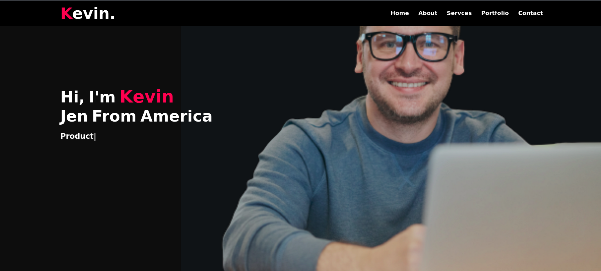

# Personal Portfolio Website
  This website is designed for the personal portfolio of web developer focusing on UI/UX Designer. The Contact Form doesn't work. You can use php code to make it work.

  This is a simple website template that you can use as a starting point for your Personal Website. It provides a basic structure and layout for a typical website. Feel free to customize it to suit your needs.

## Features

- Clean and minimal design.
- Responsive layout for mobile and desktop.
- Navigation menu.
- Placeholder content for the homepage, about page, services page, and contact page.
- Easy to customize and extend.

## Getting Started

1. Clone this repository to your local machine.
2. Customize the content and layout in the HTML and CSS files.
3. Add your images and media to the `img` directory.
4. Test your website locally using a web server or by opening the HTML files in your browser.

## Usage

You can use this template for personal or commercial projects. Please make sure to replace the placeholder content with your own and customize the design as needed.

## Contributing

If you'd like to contribute to this project, please see the [Contributing Guidelines](../../Contribution.md) for more information.

## License

This project is licensed under the GNU License - see the [LICENSE](../../LICENSE) file for details.

---

Happy coding!
