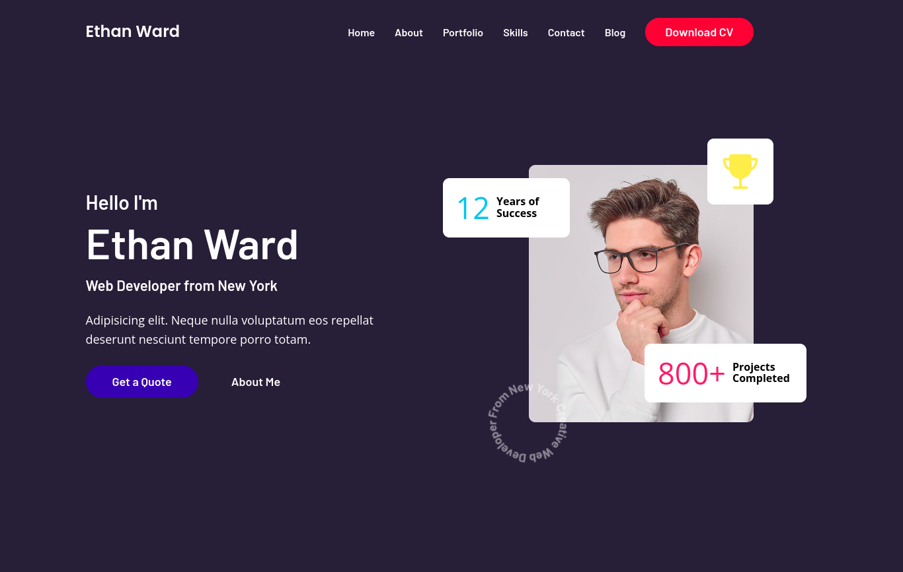

# Personal Portfolio Website
  This website is designed for the personal portfolio of web developer focusing on Web Developer Designer. The Contact Form is perfectly working. You need to createsuperuser and login to the admin dashboard for the contact us details.

  This is a simple website template that you can use as a starting point for your Personal Website. It provides a basic structure and layout for a typical website. Feel free to customize it to suit your needs.



## Features

- Clean and minimal design.
- Responsive layout for mobile and desktop.
- Navigation menu.
- Placeholder content for the homepage, about page, services page, and contact page.
- Easy to customize and extend.

## Getting Started

1. Clone this repository to your local machine.
2. Customize the content and layout in the HTML, CSS and JS files.
3. Add your images and media to the `static/img` directory.
4. Test your website locally using a web server by following Usage Section.

## Usage

You can use this template for personal or commercial projects. Please make sure to replace the placeholder content with your own and customize the design as needed.

Please Follow the steps to Run this in your local Machine.
```bash 
git clone https://github.com/cambridgeitcollege/Website-Templates

cd Website-Templates/PersonalPortfolio/Template3

pip install -r requirements.txt

python manage.py makeimgrations     # python3 manage.py makemigrations - Linux Users 

python manage.py migrate    # python3 manage.py migrate - Linux Users

python manage.py runserver  #pythoon3 manage.py runserver - Linux Users

```
Note: It will be Better if you create Virtual Environment for running in your local machine.


## Contributing

If you'd like to contribute to this project, please see the [Contributing Guidelines](../../Contribution.md) for more information.

## License

This project is licensed under the GNU License - see the [LICENSE](../../LICENSE) file for details.

---

Happy coding!

